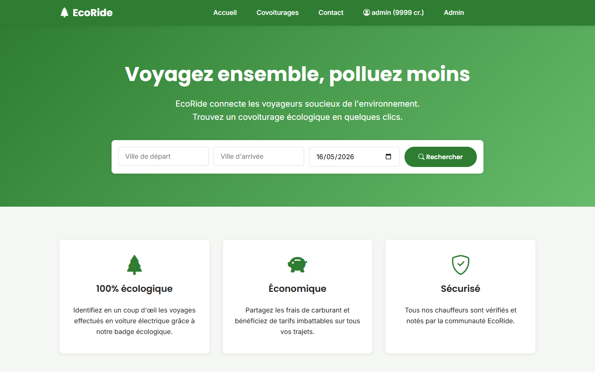
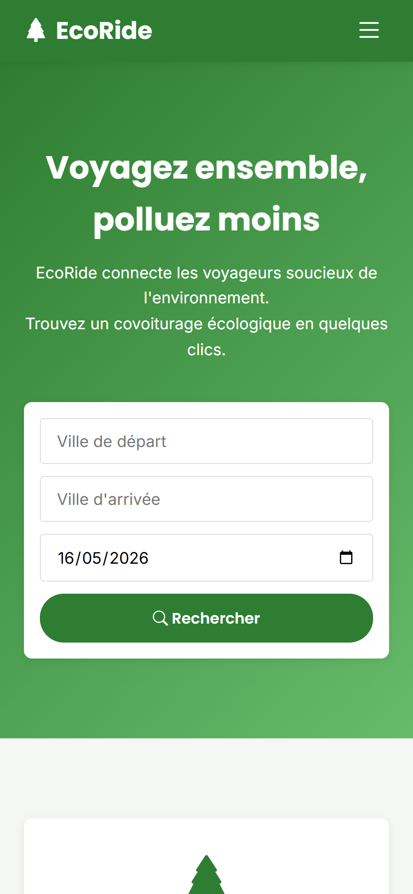
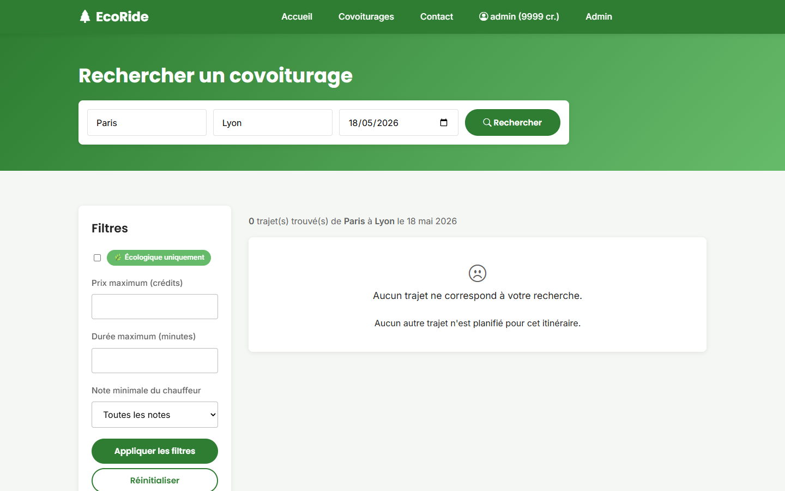
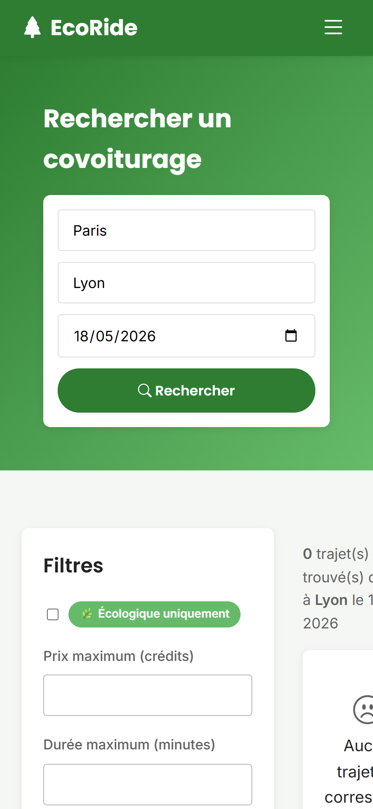
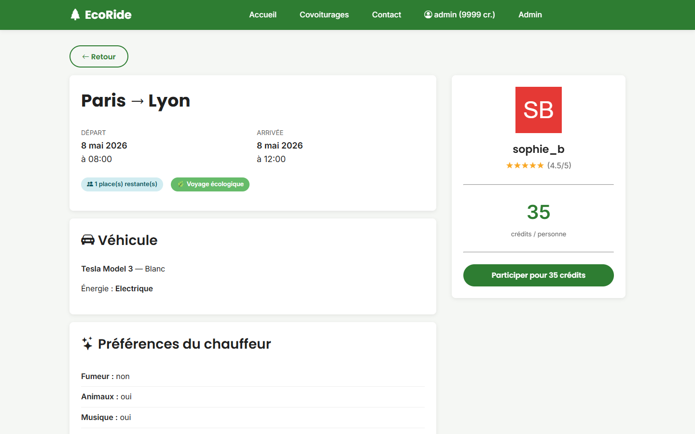
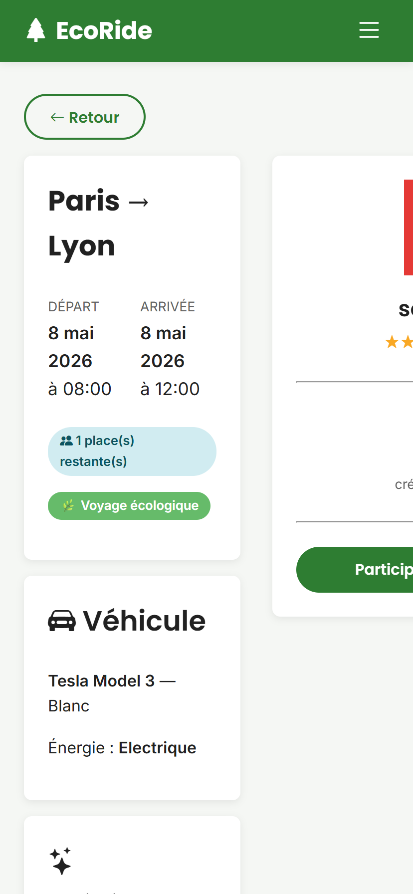
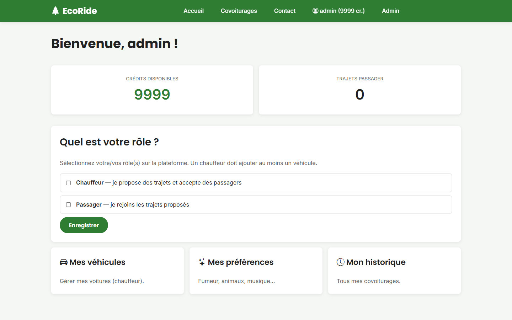
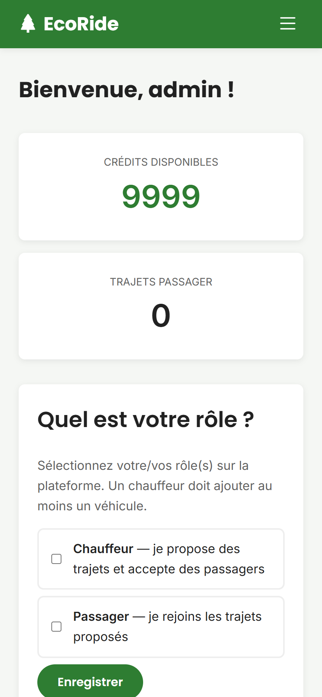
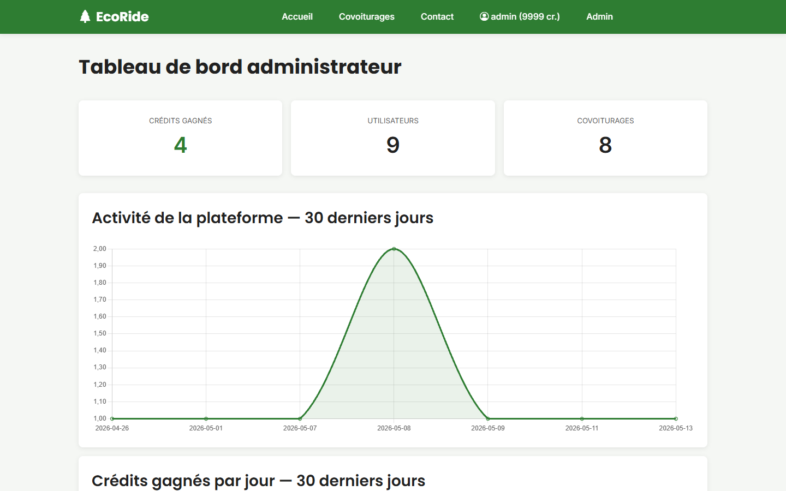
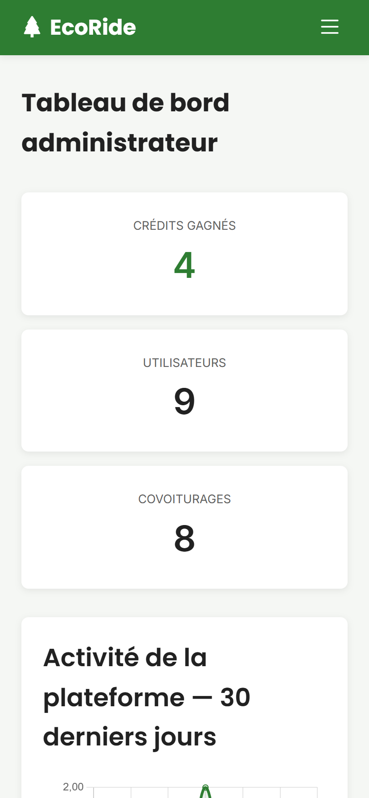

# Maquettes — EcoRide

Maquettes **haute fidélité** générées automatiquement à partir de l'application déployée
via Puppeteer (script `tools/screenshots.cjs`). Toutes les pages sont capturées en deux
formats : **desktop (1440×900)** et **mobile (414×896)**.

> Sources visuelles : captures de l'application réelle en production (sur AlwaysData)
> ou en local. Disponibles aussi sous forme de wireframes Figma équivalents (lien à venir).

## 1. Page d'accueil (US 1)

### Desktop


### Mobile


---

## 2. Recherche de covoiturages avec filtres (US 3, 4)

### Desktop


### Mobile


---

## 3. Détail d'un covoiturage (US 5, 6)

### Desktop


### Mobile


---

## 4. Page de connexion

### Desktop


### Mobile


---

## 5. Création de compte (US 7)

### Desktop


### Mobile


---

## 6. Tableau de bord administrateur (US 13)

### Desktop


### Mobile


---

## Reproduire ces captures

```bash
# Démarrer le serveur PHP local
php -S localhost:8002 -t public

# Dans un autre terminal
node tools/screenshots.cjs http://localhost:8002
```

Les captures sont régénérées dans `docs/maquettes/img/`.
