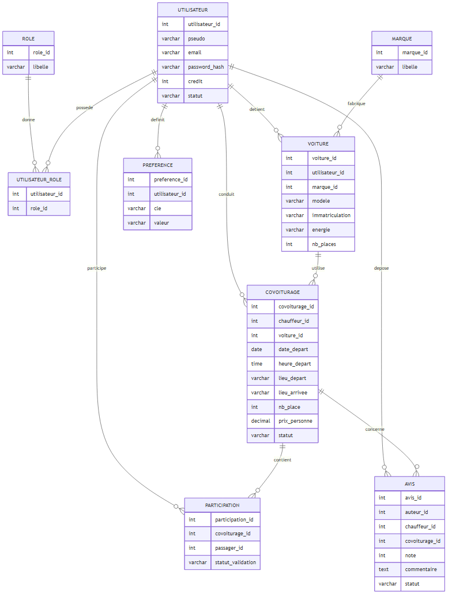

# Modèle Conceptuel de Données (MCD) — EcoRide

## Diagramme entité-association avec cardinalités

> Source : [`mcd.mmd`](mcd.mmd) — généré via Mermaid CLI (`npx mmdc -i mcd.mmd -o img/mcd.png`).

## Cardinalités explicites

| Relation | Cardinalité | Description |
|----------|-------------|-------------|
| ROLE — UTILISATEUR_ROLE | (1,1) → (0,N) | Un rôle est attribué à 0..N utilisateurs |
| UTILISATEUR — UTILISATEUR_ROLE | (1,1) → (0,N) | Un utilisateur possède 0..N rôles (table associative N-N) |
| UTILISATEUR — VOITURE | (1,1) → (0,N) | Un utilisateur détient 0..N voitures |
| UTILISATEUR — COVOITURAGE | (1,1) → (0,N) | Un utilisateur (chauffeur) conduit 0..N trajets |
| UTILISATEUR — PARTICIPATION | (1,1) → (0,N) | Un utilisateur participe à 0..N trajets en tant que passager |
| UTILISATEUR — AVIS | (1,1) → (0,N) | Un utilisateur dépose 0..N avis |
| UTILISATEUR — PREFERENCE | (1,1) → (0,N) | Un utilisateur définit 0..N préférences |
| MARQUE — VOITURE | (1,1) → (0,N) | Une marque équipe 0..N voitures |
| VOITURE — COVOITURAGE | (1,1) → (0,N) | Une voiture utilise 0..N trajets |
| COVOITURAGE — PARTICIPATION | (1,1) → (0,N) | Un trajet contient 0..N participations |
| COVOITURAGE — AVIS | (1,1) → (0,N) | Un trajet est concerné par 0..N avis |

## Description des entités

### ROLE
Définit les rôles applicatifs : `visiteur`, `utilisateur`, `chauffeur`, `passager`, `employe`, `administrateur`. Un utilisateur peut cumuler plusieurs rôles (ex : chauffeur + passager).

### UTILISATEUR
Compte créé par un visiteur. Champs sensibles :
- `password_hash` : haché avec `password_hash()` PHP (bcrypt par défaut)
- `credit` : initialisé à 20 lors de la création (US 7)
- `statut` : `actif` ou `suspendu` (suspension par admin — US 13)

### MARQUE
Référentiel des marques de véhicules (Renault, Peugeot, Tesla, etc.) pour normaliser et éviter les doublons.

### VOITURE
Véhicule déclaré par un chauffeur. Le champ `energie` permet d'identifier les voitures électriques pour le filtre écologique (US 4).

### COVOITURAGE
Trajet proposé par un chauffeur. Statuts possibles :
- `prevu` : créé, pas démarré
- `en_cours` : démarré (US 11)
- `termine` : arrivé à destination (US 11)
- `annule` : annulé par le chauffeur (US 10)

### PARTICIPATION
Lien entre un passager et un covoiturage. Le `statut_validation` trace la validation post-trajet (US 11) :
`en_attente`, `valide_ok`, `valide_probleme`, `annule`.

### AVIS
Avis et note (1-5) laissés par un passager sur un chauffeur après un trajet. Modération asynchrone par un employé (US 11/12). Statut `en_attente` → `valide` ou `refuse`.

### PREFERENCE
Préférences extensibles du chauffeur (fumeur, animaux, musique…). Modèle clé/valeur permettant l'ajout libre de préférences personnalisées (US 8).

## Choix de répartition SQL / NoSQL

| Donnée | Stockage | Justification |
|--------|----------|---------------|
| Utilisateurs, rôles, voitures, covoiturages, participations | **MySQL** | Données fortement relationnelles, transactions ACID (transfert de crédits, place restante) |
| Avis | **MongoDB** | Structure flexible (commentaire long), modération asynchrone, affichage agrégé. La table SQL est conservée comme alternative |
| Préférences chauffeur | **MongoDB** | Schéma libre (clés/valeurs ajoutables par l'utilisateur) |
| Configuration / paramètres | **MongoDB** | Lecture fréquente, écriture rare, pas de relations |
