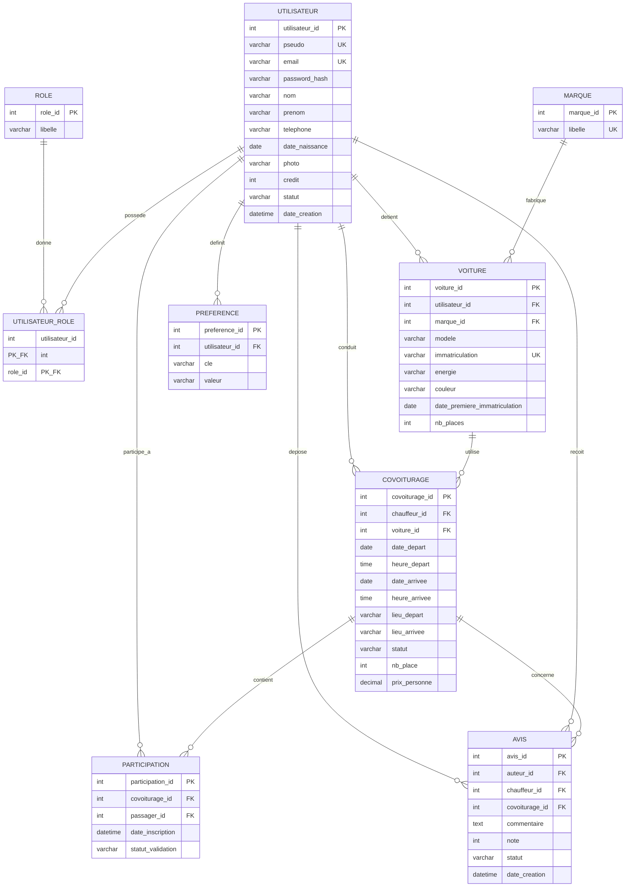

# Modèle Conceptuel de Données (MCD) — EcoRide

## Diagramme Mermaid

## Description des entités

### ROLE
Définit les rôles applicatifs : `visiteur`, `utilisateur`, `chauffeur`, `passager`, `employe`, `administrateur`. Un utilisateur peut cumuler plusieurs rôles (ex : chauffeur + passager).

### UTILISATEUR
Compte créé par un visiteur. Champs sensibles :
- `password_hash` : haché avec `password_hash()` PHP (bcrypt par défaut)
- `credit` : initialisé à 20 lors de la création (US 7)
- `statut` : `actif` ou `suspendu` (suspension par admin — US 13)

### MARQUE
Référentiel des marques de véhicules (Renault, Peugeot, Tesla, etc.). Permet de normaliser et d'éviter les doublons.

### VOITURE
Véhicule déclaré par un chauffeur. Le champ `energie` permet d'identifier les voitures électriques pour le filtre écologique (US 4).

### COVOITURAGE
Trajet proposé par un chauffeur. Statuts possibles :
- `prevu` : créé mais pas démarré
- `en_cours` : démarré (US 11)
- `termine` : arrivé à destination (US 11)
- `annule` : annulé par le chauffeur (US 10)

### PARTICIPATION
Lien entre un passager et un covoiturage (table associative). Le statut `statut_validation` permet de tracer la validation post-trajet (US 11) : `en_attente`, `valide_ok`, `valide_probleme`.

### AVIS
Avis et note laissés par un passager sur un chauffeur après un trajet. Statut `en_attente` jusqu'à validation par un employé (US 11/12).

### PREFERENCE
Préférences extensibles du chauffeur (fumeur, animaux, musique, etc.). Modèle clé/valeur pour permettre au chauffeur d'ajouter ses propres préférences (US 8).

## Choix de répartition SQL / NoSQL

| Donnée | Stockage | Justification |
|--------|----------|---------------|
| Utilisateurs, rôles, voitures, covoiturages, participations | **MySQL** | Données fortement relationnelles, cohérence transactionnelle requise (transfert de crédits, place restante) |
| Avis | **MongoDB** | Données non critiques, structure flexible (commentaire long, modération asynchrone), affichage agrégé. Possibilité d'enrichir sans migration |
| Préférences chauffeur | **MongoDB** | Schéma libre (chauffeur peut ajouter ses propres clés), pas de contrainte d'intégrité forte |
| Configuration / paramètres app | **MongoDB** | Lecture fréquente, écriture rare, pas de relations |

> Note : la table `AVIS` MySQL est conservée comme **alternative** au cas où la consigne d'évaluation exigerait l'avis en relationnel. En production réelle, je n'utiliserais qu'un des deux stockages.
