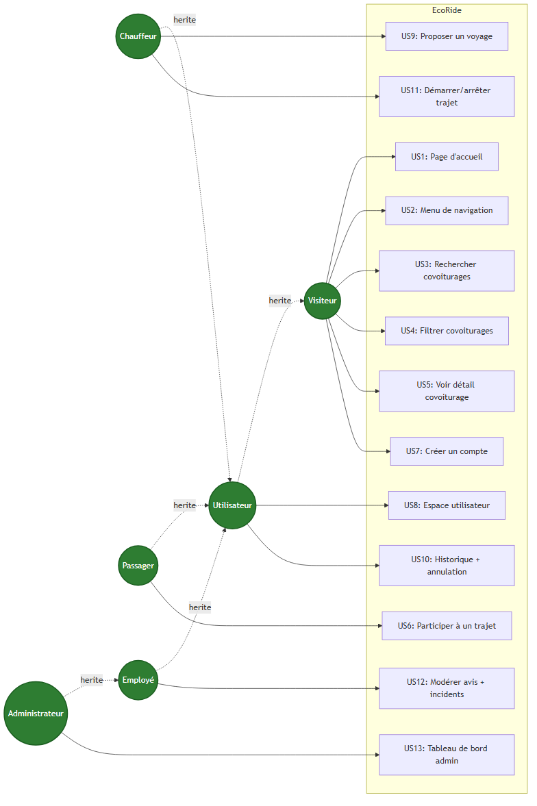

# Diagramme de cas d'utilisation — EcoRide

> Source : [`use-case.mmd`](use-case.mmd) — généré via Mermaid CLI.

## Acteurs et relations d'héritage

| Acteur | Hérite de | Description |
|--------|-----------|-------------|
| **Visiteur** | — | Utilisateur non authentifié |
| **Utilisateur** | Visiteur | Personne ayant créé un compte (rôle de base) |
| **Chauffeur** | Utilisateur | Utilisateur qui propose des trajets |
| **Passager** | Utilisateur | Utilisateur qui participe à des trajets |
| **Employé** | Utilisateur | Modère les avis et gère les incidents |
| **Administrateur** | Employé | Gère les comptes et accède aux statistiques |

## Cas d'utilisation par acteur

### Visiteur (US 1, 2, 3, 4, 5, 7)
- **US1 — Voir la page d'accueil** : consulter la présentation de la plateforme + barre de recherche
- **US2 — Naviguer dans le menu** : accéder aux sections principales
- **US3 — Rechercher un covoiturage** : saisir ville de départ / arrivée / date
- **US4 — Filtrer les résultats** : par aspect écologique, prix, durée, note
- **US5 — Voir le détail d'un trajet** : véhicule, chauffeur, avis, préférences
- **US7 — Créer un compte** : pseudo + email + mot de passe robuste, 20 crédits offerts

### Utilisateur (US 8, 10)
- **US8 — Mon espace** : choisir son rôle (chauffeur / passager), gérer ses véhicules, préférences
- **US10 — Historique** : voir tous ses trajets, annuler une participation

### Chauffeur (étend Utilisateur — US 9, 11)
- **US9 — Proposer un voyage** : créer un trajet (départ / arrivée / horaires / véhicule / prix)
- **US11 — Démarrer et arrêter un trajet** : transition de statut + notification

### Passager (étend Utilisateur — US 6)
- **US6 — Participer à un covoiturage** : double confirmation + débit crédits + transaction ACID

### Employé (étend Utilisateur — US 12)
- **US12 — Modérer les avis** : valider/refuser les avis avant publication
- **US12 — Gérer les incidents** : trajets signalés problématiques avec coordonnées

### Administrateur (étend Employé — US 13)
- **US13 — Tableau de bord** : 2 graphiques Chart.js (covoiturages/jour, crédits/jour)
- **US13 — Gérer les comptes** : suspendre / réactiver utilisateurs et employés
- **US13 — Créer un employé** : formulaire de création réservé à l'admin
